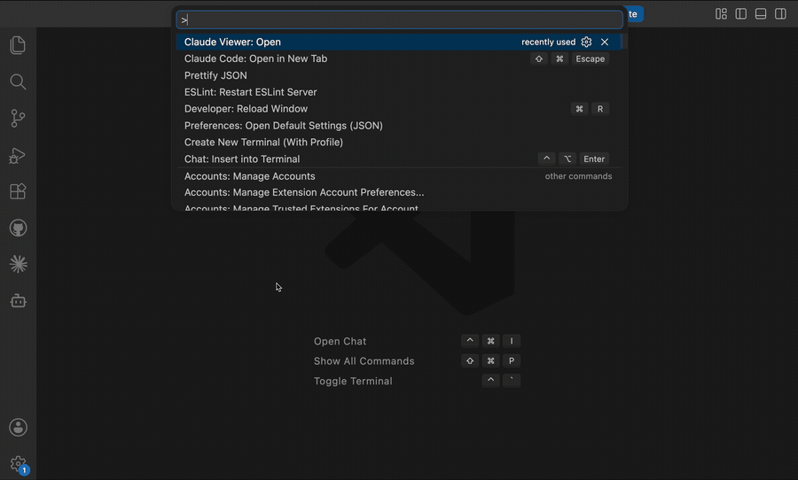

# Claude Viewer

> *README written by a human for humans*

This is a VSCode extension for viewing the **RESOLVED** state for your agent, like Claude Code. Once a harness is initialized, there's a merger of skills, system prompt `md`s, memories etc. This extension provides a visualization of all these, in a way that makes maintaining agents easier.



## Current State
- [x] Skills View, coming from the user specific `~/.claude/` folder, the project's global `.claude/` folder, and active plugins.
- [x] System Prompt View, merging CLAUDE.md or similar files.
- [x] Memory View, for the files Claude writes about you — grouped by type, with what the
      `MEMORY.md` index costs every session, and the two ways it goes wrong: a memory nothing points
      at, and an index line pointing at nothing. Copilot's memories live on GitHub rather than on
      disk, so that half of the surface says where to find them instead of listing them.
- [ ] Hooks for tool invocations etc
- [ ] Permissions

## URI Support
(Basically the reason why I'm doing this project) The extension comes with URI support for opening the views, specific skills, and hopefully in the future, actual useful actions. The core idea here is using Extension URI support as a better, progressively disclosed (and thus, scalable) MCP Server. A minimal intent indication can point towards a `--help` .md file which indicates the best ways to have your Agent interact (open, update) this UI. This makes VSCode an App Marketplace with built-in agent interactions (and BYOA!!).


```
vscode://canoq.claude-viewer/skill/commit
vscode://canoq.claude-viewer/skill/deploy?scope=user   # a specific scope's copy
vscode://canoq.claude-viewer/skill                     # just open the picker

vscode://canoq.claude-viewer/skill/dev-feature#7-release-the-worktree
vscode://canoq.claude-viewer/skill/dev-feature?section=7   # same thing, if the # is dropped
```

A `#section` names a heading inside the skill, so a link can point at the step you mean rather than
the top of the file. It's matched loosely — the heading's text, the slug, or just its number all
work — and when the heading is one of the steps the flow view draws, the link opens the flow with
that step already open. A section that matches nothing is ignored: the skill still opens.

## Install

> Ok, from this point on, this part was AI generated, it's boring

Search for **Claude Viewer** in the Extensions view, or:

```
code --install-extension canoq.claude-viewer
```

Then open the Command Palette and run **Claude Viewer: Launch Viewer**.


## Unofficial

This is a community project. It is not affiliated with, endorsed by, or supported by Anthropic.
"Claude" and "Claude Code" are trademarks of Anthropic, used here only to describe what the
extension reads.

## License

MIT
